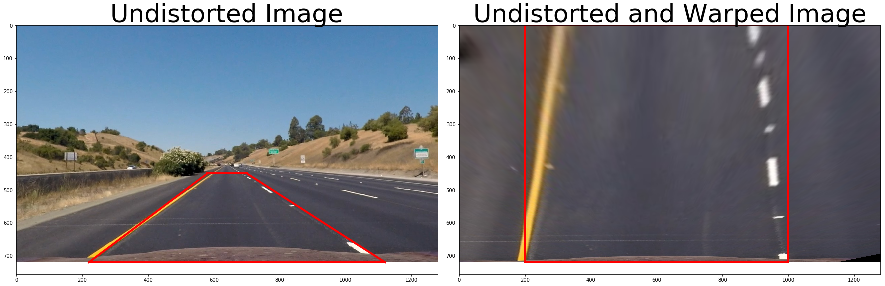

# **Advanced Lane Finding Project**

### The goals / steps of this project are the following:

* Compute the camera calibration matrix and distortion coefficients given a set of chessboard images.
* Apply a distortion correction to raw images.
* Use color transforms, gradients, etc., to create a thresholded binary image.
* Apply a perspective transform to rectify binary image ("birds-eye view").
* Detect lane pixels and fit to find the lane boundary.
* Determine the curvature of the lane and vehicle position with respect to center.
* Warp the detected lane boundaries back onto the original image.
* Output visual display of the lane boundaries and numerical estimation of lane curvature and vehicle position.

## Step 1 - Camera Calibration

In the cell number 3 of my ipynb file this step is implemented
For camera calibration, i have used the following steps - 
1. empty list for storing imagepoints and objectpoints is created
2. objectpoint objp is prepared of the size of chessboard which is 9*6
3. Using os, I created list of image names, then in a for loop below steps are implemented - 
    - reading the image and converting it into grayscale format
    - Using function cv2.findChessboardCorners() the corners are detected
    - the corners are the appended into the imagepoints list and for the same imag objp is appended into objectpoints list
    - finally we got the objectpoints and imagepoints which can be later used for undistorting images
    - at the end in order to be sure that the corners detected are correct, corners on the chessboard are drawn

 
Some of the examples of detected corners are given below:    

In cell number 4 by using the function cv2.calibrateCamera() using the above collected imagepoints, objectpoints and the size of the image the camera matrix mts and the distortion coefficient dist has been calculated

## Step 2 - Distortion Correction

First the camera matrix and distortion coefficients are calculated separately and then a function with name cal_undistort is created whcih accepts the image, and some collected values from above steps like objectpoint and imagepoints and returns the undistorted image is implemented in cell 4 of the code.

The camera matrix mts and the distortion coefficient from above step is used here for removing the distortion in the image.

For this the function cv2.undistort from openCV is used.
One of the example of removing distortion on the chessboard image is
attached below:

Here the function is used and applied on the lane image and the undistorted and orignial image is attached.

## step 3 - Creating thresholded binary Image

This step is implemented in cell 6 of the notebook.
there are many techniques of getting the binary threshold image which contains the lane pixels, Based on my experience of learning from the course I have used following technique

1. First the image is converted from RGB space to HLS space, then S component of the image is taken spearately and s threshold is created and also R channel image is created.
2. Usign sobel technique, the derivative of the image is obtain on x axis and then mapped to values between 0 to 255 as the image of type 8 bits.
3. Gradient Thresholding - thresholding on the derivative image (x gradient) is applied with min value =20 and mx value = 100 that means, pixel values greater than 20 and less than 100 are taken and are represented as white pixels 
4. Color Thresholding - thresholding on the R&S channel image is applied with range between 90to 144 for S channel and 200 to 255 for R Channel.
5. the two outputs from color threshold are combined and then Gradient thresholding and final Color thresholding is combined using OR logic

Note: Based on the reviewer suggestion, I tried some morphological techniques to improve performance of shadow images, but it did not help, so I removed that.

One of example of a lane image thresholded is attached below - m

## step -4 Prespective Transform

In the cell number 9 of the code the prepesctive transform of the image is implememted

A function with the name warper is created, the function does following steps

1. undistoring the image using the cal_undistort() function created in step 2 which accepts the image, previously created objectpoints and imagepoints from step 1
2.  follwoing source and destination points are used to apply prespective transform
 
<table>
<b><td><b>source point</td><td><b>Destination points</td>
<tr><td>[220,720]</td><td>[200, 720]</td></tr>
<tr><td>[1120,720]</td><td>[1000, 720]</td></tr>
<tr><td>[700,450]</td><td>[1000, 0]</td></tr>
<tr><td>[580,450]</td><td>[200, 0]</td></tr>
</table>
    
3. Using the function cv2.getPerspectiveTransform() and cv2.warpPerspective the warped image is obtained.
4. using the dst and src, the inverse matrix is also obtained which will be used to map back to original image once lane pixels are properly detected.

An example of the prespective transformed image is attached below

Example of prespective transform on binary thresholded image is attached here:

## step 5 - Finding lane line pixels and polynomial fit

In the cell 11 of the notebook this step is implemented.
below steps are taken to identify laneline pixels and then performing a polynomial fit

1. the first step is taking the histogram of binary halg image because in the binary half the cordinates where the actual lane line pixels lie we should get high peak in the histogram, taking bottom half will remove the noise from the top half
2. Now the peaks of left and right half is calculated using numpy.argmax function
3. the image is divided into 9 windows with a widow margin of 100, the threshold for minimum number of pixels to be observed in a window is set to 50
4. All the nonzero pixel positions are identified and stored in nonsserox, nonzeroy
4. using a for loop running through all the windows i.e. 9 windows, the boundaries of the window are extracted using margin and thene nonzeros pixels are identified in respective window and finally the left and right lane indeices corresponding to the nonzero pixels in respective windows are appended into left_lane_inds and right_lane_inds
5. finally the ledt and right line pixel positions are identified.
  
    Now as we have final left are right lane line pixel positions its time to fit the polynomial line on it. for this step a function with the name fit_polynomial is created.
    
In the fit_polynomial function, a quadratic equation which is 
 
 A*y^2 + B*y + c 
 
 is fit
 where 
 first left_fit and right_fit is calculated using numpy.polyfit on output of below step
 and  A = left_fit[0], B = left_fit[1] and C = left_fit[2] is used.
 
 left lane pixels and right lane pixels are coloured red and blue respectively.
 the polynominal is plotted with yellow color.
 
 The output of above step is attached here - 

## step 6 - Calculating the radius of curvature and distance from lane

to convert the radius of corvature into meters from pixel following factor is used - 

ym_per_pix = 30/720 # meters per pixel in y dimension
xm_per_pix = 3.7/800 # meters per pixel in x dimension

following formula is used to calculate the radius of curvature on left and right lane 

<h4>R = ((1 + (2*A*y*ym + B)**2)**1.5) / |2*A|</h4>

further the value of left curvature and right curvature is averaged.

TO calcualte the position of the car firs the center of the lane is obtained and then the center of the image is calculated and the distance between the center of the image and center of lane is considered as the distance of the vehicle from the center.

<b>Distance of Vehicle from center = Center of Image - Center of the lane

## searching lane pixels from previuos frame

A look ahead check for finding lane line pixels is implemented in the function search_around_poly()
in cell number 

So fir the first time the window method will be used to identify the laneline pixel and after that with the margin on 100 the other pixels will be identified.

If the length of the vectors on the right lane of pixle postion is empty again window mehthod will be triggered.

A class main_pipeline is created to keep track of previous frame lane pixel positions, the radius value.
In side the class in cell number 13
To get the lane boundaries on the original image, using cv2.fillpoly() function the lanes are drawn on the watped blank image
then the blank image is warped back to the orignial image using inverse prespective matrix
the result is then combined with the orignial image

Two global variables are created to retain the previous value of left and right lane pixels and then low pass filter for lane curvature and distance from center is used to reuse the previous frames

## Faced Challenges - 

1. While understanding how to take destination points while performing prespective transform, later on the questions asked by other learners in past helped.
2. How to take the 30m range for source point was a BIG deal and still I have doubts on it
3. Calcultion of final radius of curvature from left and right is what I thought of taking average based on intution but got it confirmed by reading some questions.

